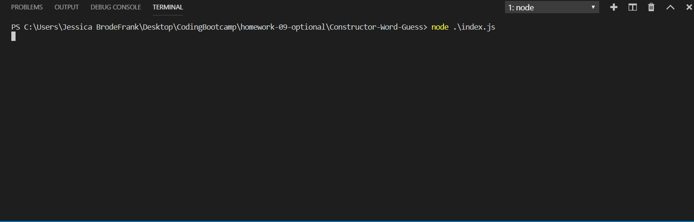

# Constructor-Word-Guess
A word guess game that is played completely in the termal. The game will automatically start a new game whenever an old game is won or lost. 

To play try to guess the word that is being displayed in the terminal. To guess a letter type the letter you want to guess into the terminal and press 'enter'.

Ctrl-C will exit the terminal program.

Make sure to have all npm dependencies installed before running the app.
Dependencies include: inquirer